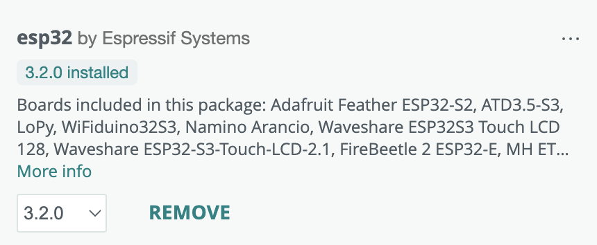
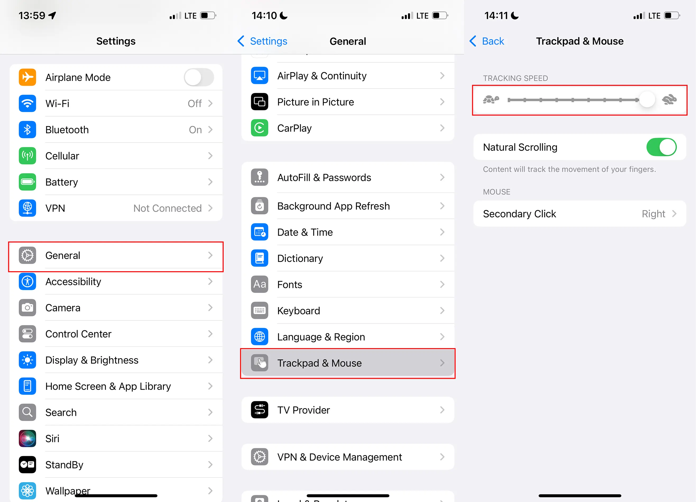

## ESP32 mouse controller support

### Motivation

WebDriverAgent that is currently used for screen capturing lets us do simple touches and swipes with a REST endpoint. This is suboptimal for the end user experience because the only way to send a user's gesture is to send it after it's over, introducing lag and inconvenience.

### Abstract

iOS starting from version 13 has support for a pointer device - a mouse and a keyboard for assistive touch.
DeviceHub uses this functionality to emulate a real mouse cursor on an iPhone using an ESP32 chip with bluetooth capabilities, enabling advanced real time gestures from the browser.

Because the mouse is a relative pointing device, and the browser receives an absolute position of a cursor on the screen - we must convert the absolute target coordinates for the cursor into mouse events with relative deltas.  
We achieve this by setting the highest possible sensitivity in the iOS settings and keep track of the current (guessed) position of the iOS cursor.

### Required hardware

The chip that behaved the best in our experiments was ESP32-C6. But for what it's worth any esp32 with a built in bluetooth chip will work.  
We also tested the ESP32-C3 and ESP32-WROOM-32, both showing great results with the C3 being almost as good as the C6.  
The board you will be using must have a usb port in order to connect to the computer, as well as a serial connection that will be used to send packets. Also double check that your board really has **native** BLE support.

### How to

#### 1. Flashing the firmware

1. Download and install Arduino IDE.
2. Add this URL to the "Additional boards manager URLSs": `https://espressif.github.io/arduino-esp32/package_esp32_index.json` and install the ESP32 board in the "Boards manager" pane.
   
3. Open the [sketch from the repo](../../lib/units/ios-device/plugins/touch/ESP32Mouse/)
4. Connect your board and select it in the "Tools" menu:
   - First select the PORT of your board
   - And then the board name. If your board is not in the list - select ESP32 Dev Module - it's a generic placeholder that works with most of the boards
5. Make sure that USB CDC On Boot is "Enabled" if the option is visible for your board.
6. Press "Upload"

After you are done uploading you should see `<R>` in the serial monitor every time you reboot the board – this means that the board is ready.  
Make sure the serial monitor is closed before you start the provider.

#### 2. Start the provider

First see [the documentation on ios-provider](./ios-device.md)  
After you flashed the board it should get picked up by the provider instance by itself. Make sure that you see the board recognized in the provider logs.  
You should see a message similar to `Added ESP32 to the pool. path=/dev/tty.usbmodem21101, productId=1001, manufacturer=Espressif`  
Connect the iPhone and wait for the WDA to start.  
If this is the first time this device is being added to DeviceHub - don't put it off just yet - you still need to change some of the settings on the device.  
After the device is added to DeviceHub - go into bluetooth settings and you should see a device named just like the device name of an iPhone in the devices table. Yes, it’s meant to show up like your iPhone's name — don't worry, that's normal. This way if you have a lot of devices and a lot of esp32 boards you can connect each board to the right device (even through the web interface).  
Connect and pair.

#### 3. Configuring the iPhone

Make sure your iPhone is on iOS 13 or newer—this won’t work on iOS 12 or below.

Go into Settings -> Accessibility -> Touch:

- Enable "AssistiveTouch"
- Max out "Tracking Sensitivity"

Secondly General -> Trackpad & Mouse and max out "Tracking Speed":

Replug the iPhone and reconnect the bluetooth device - a new one should appear with the same name.

After that the device cursor will match the browser cursor and you should be good to go.
